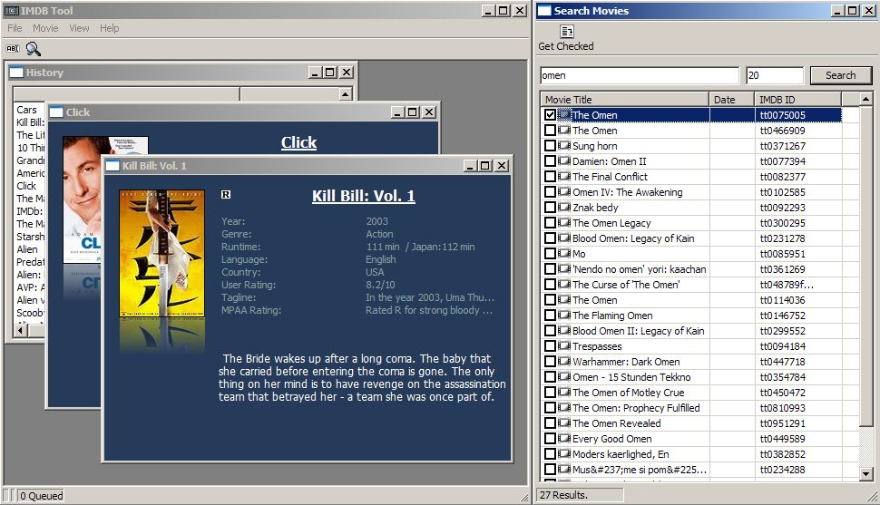



## IMDB tool 2007 update

### Description

Connect to the Internet Movie Database (IMDB) and download movie data in a nice little vb interface. This update adds some gui effects and proper parsing of the new IMDB HTML. History feature was also added. enjoy
 
### More Info
 

             |
---                |---
**Submitted On**   |2007-02-10 20:38:38
**By**             |[Tecc](https://github.com/Planet-Source-Code/PSCIndex/blob/master/ByAuthor/tecc.md)
**Level**          |Advanced
**User Rating**    |5.0 (10 globes from 2 users)
**Compatibility**  |VB 6\.0
**Category**       |[Internet/ HTML](https://github.com/Planet-Source-Code/PSCIndex/blob/master/ByCategory/internet-html__1-34.md)
**World**          |[Visual Basic](https://github.com/Planet-Source-Code/PSCIndex/blob/master/ByWorld/visual-basic.md)
**Archive File**   |[IMDB\_tool\_2054503182007\.zip](https://github.com/Planet-Source-Code/tecc-imdb-tool-2007-update__1-68161/archive/master.zip)

